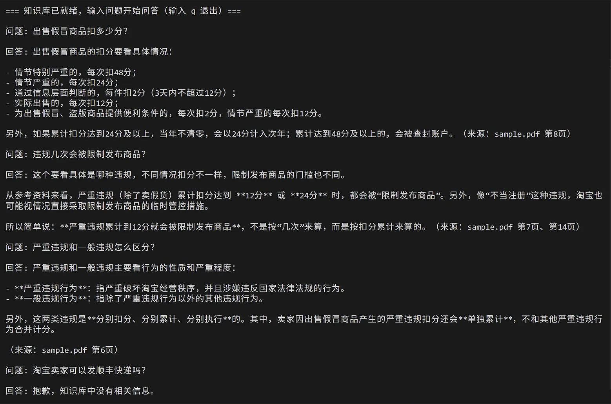

# Irene-a11y-kit

欢迎来到 `Irene-a11y-kit`！这是一个专注于 AI 多模态应用与 RAG（检索增强生成）技术的实战项目仓库。

本仓库包含了一系列基于 **DeepSeek**、**LangChain** 以及 **HuggingFace** 生态的 Python 实践 Demo。无论是探索多模态视觉理解，还是构建本地化的文档问答系统，你都能在这里找到开箱即用的代码示例。

## 项目导航 (Project Navigation)

本仓库包含以下独立的实战项目，点击文件夹即可跳转查看：

| 项目名称 | 核心技术 | 简介 |
| :--- | :--- | :--- |
| [**Demo1_Flash_Vision**](./Demo1_Flash_Vision) | DeepSeek Vision, OpenAI SDK | 调用 DeepSeek 多模态模型进行图片内容解析与识别。 |
| [**Demo2_FAQ_assistant_rag**](./Demo2_FAQ_assistant_rag) | RAG, DeepSeek Chat | 基于 RAG 技术构建的本地 FAQ 客服自动问答助手。 |
| [**Demo3_Doc_Chat_RAG**](./Demo3_Doc_Chat_RAG) | LangChain, FAISS, HuggingFace | 完整的 PDF 文档解析与 RAG 问答链路（含中文向量模型优化）。 |

## 快速开始

每个子项目都是一个独立的 Python 环境，拥有独立的 `.gitignore` 和 `requirements.txt`（或依赖说明）。

1. 点击上述表格跳转到你感兴趣的 Demo。
2. 阅读该子项目下的独立 `README.md` 获取环境配置与运行指南。

### 效果预览
**Demo3_Doc_Chat_RAG**：基于淘宝规则 PDF 的问答（前三轮答对 + 第四轮不编造）

## 技术栈概览

- **大模型 (LLM)**: DeepSeek Flash
- **编排框架**: LangChain (LCEL)
- **向量数据库**: FAISS（Demo3）/ Chroma（Demo2）
- **Embedding**: HuggingFace `bge-small-zh-v1.5`（Demo3）
- **开发语言**: Python 3.11+

---

> **提示**: 运行任何项目前，请确保已在对应的子项目根目录下配置好 `.env` 环境变量。

## 许可证

MIT License
